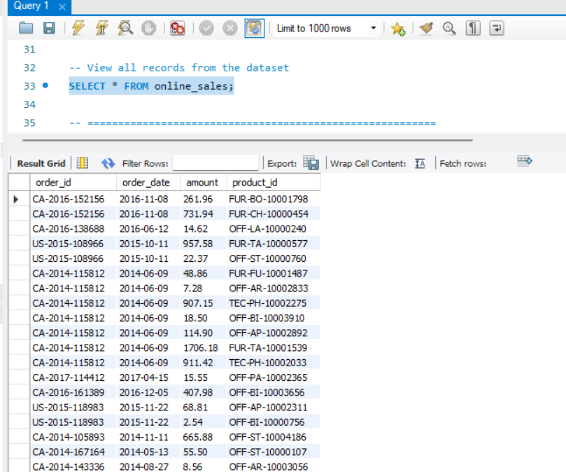
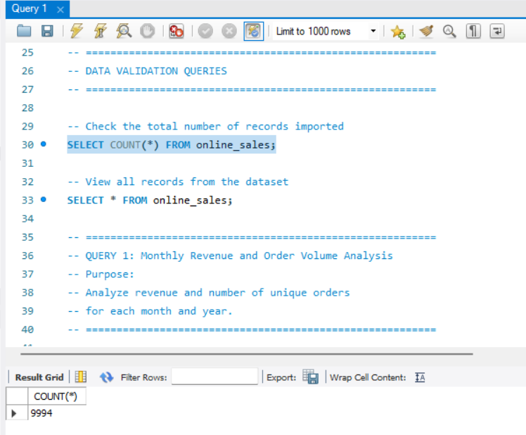
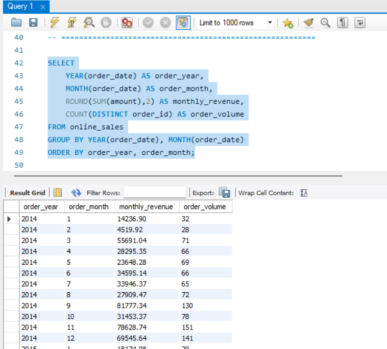
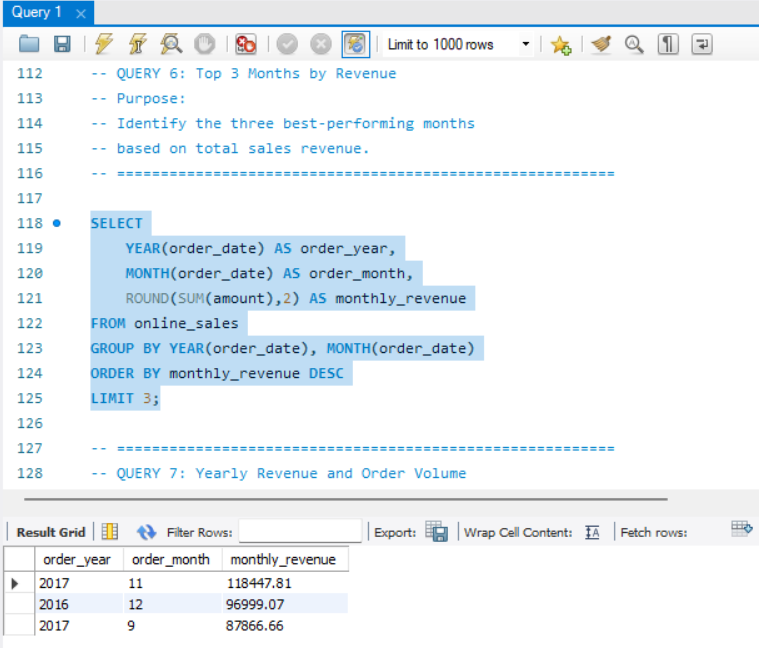
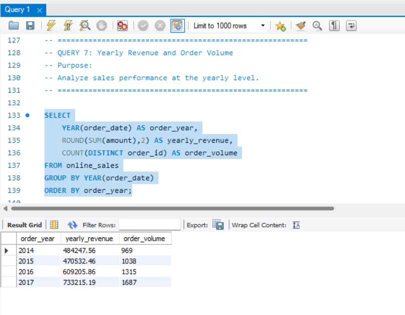

# 📊 Sales Trend Analysis Using SQL

## 📌 Project Overview

This project focuses on analyzing sales trends using SQL aggregation techniques. The analysis was performed on an online sales dataset to identify monthly revenue patterns, order volume trends, yearly performance, and top-performing products.

The project demonstrates the use of SQL functions such as `SUM()`, `COUNT()`, `COUNT(DISTINCT)`, `GROUP BY`, `ORDER BY`, and date functions for time-based analysis.

---

## 🎯 Objective

The primary objectives of this project are:

- Analyze monthly revenue trends.
- Analyze monthly order volume.
- Identify top-performing months based on revenue.
- Evaluate yearly sales performance.
- Identify top revenue-generating products.
- Calculate average order value.

---

## 🛠️ Tools & Technologies

- MySQL
- SQL
- CSV Dataset
- MySQL Workbench

---

## 📂 Project Structure

```text
Sales-Trend-Analysis-SQL
│
├── Dataset
│   └── online_sales.csv
│
├── SQL Queries
│   └── sales_trend_analysis.sql
│
├── Screenshots
│   ├── 01_Dataset_Preview.png
│   ├── 02_Total_Records.png
│   ├── 03_Monthly_Revenue_and_Order_Volume.png
│   ├── 04_Top_3_Months_by_Revenue.png
│   └── 05_Yearly_Revenue_and_Order_Volume.png
│
└── README.md
```

---

## 🗃️ Dataset Information

The dataset contains sales transaction records with the following fields:

| Column Name | Description |
|------------|-------------|
| order_id | Unique order identifier |
| order_date | Date of order placement |
| amount | Sales amount |
| product_id | Product identifier |

---

## 📝 SQL Concepts Used

- Database Creation
- Table Creation
- Data Import
- Aggregate Functions
  - `SUM()`
  - `COUNT()`
  - `COUNT(DISTINCT)`
- Date Functions
  - `YEAR()`
  - `MONTH()`
- `GROUP BY`
- `ORDER BY`
- Filtering with `WHERE`
- Revenue Analysis
- Trend Analysis

---

## 📊 Analysis Performed

### 1. Monthly Revenue and Order Volume Analysis

Calculated:

- Monthly Revenue
- Monthly Order Volume

Using:

```sql
SUM(amount)
COUNT(DISTINCT order_id)
```

---

### 2. Monthly Revenue Analysis

Calculated total revenue generated for each month.

---

### 3. Monthly Order Volume Analysis

Calculated the number of unique orders placed each month.

---

### 4. Year-Specific Monthly Analysis

Analyzed monthly revenue and order volume for a selected year.

---

### 5. Top Products by Revenue

Identified the highest revenue-generating products.

---

### 6. Top 3 Months by Revenue

Determined the best-performing months based on total sales revenue.

---

### 7. Yearly Revenue and Order Volume

Compared sales performance across different years.

---

### 8. Average Order Value Analysis

Calculated:

```text
Average Order Value = Total Revenue / Order Volume
```

---

## 📸 Screenshots

### Dataset Preview


### Total Records Imported


### Monthly Revenue and Order Volume


### Top 3 Months by Revenue


### Yearly Revenue and Order Volume


---

## 🔍 Key Insights

- Monthly revenue trends help identify peak sales periods.
- Order volume analysis reveals customer purchasing patterns.
- Revenue varies significantly across months and years.
- A small number of products contribute a large portion of total revenue.
- Average order value helps evaluate customer spending behavior.

---

## 🚀 Outcome

This project helped in understanding how SQL aggregation functions can be used to perform sales trend analysis and generate meaningful business insights from transactional data.

The analysis can support decisions related to:

- Revenue Monitoring
- Sales Performance Tracking
- Product Performance Evaluation
- Business Growth Analysis
- Trend Identification
- Customer Purchase Behavior

---

## 👨‍💻 Author

**Abhishek Savita**

GitHub: https://github.com/Abhishek-Savita-3012
